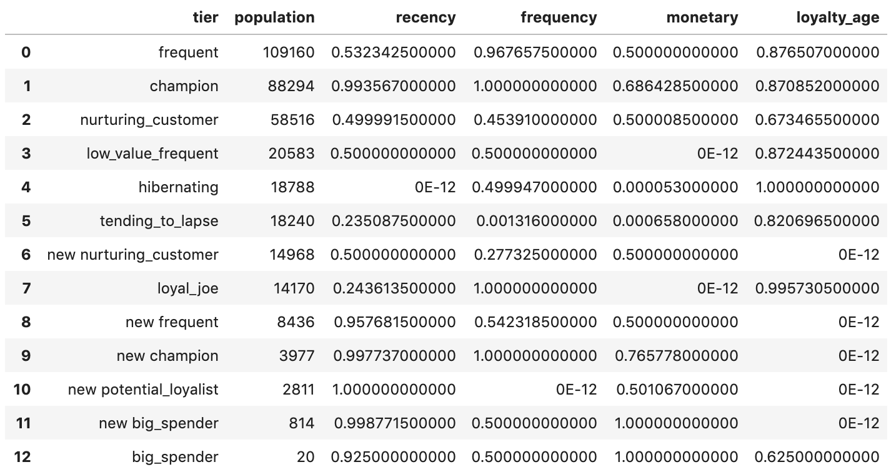
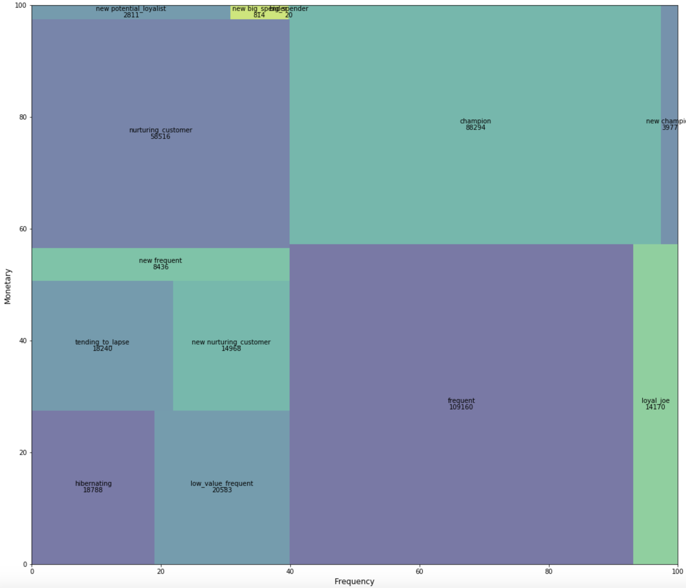

aligned_treemap
========

Pure Python implementation of the squarify treemap layout algorithm.

version: 1.0.0

####Weight Balanced Treemap Layout

by Tony Tong, tony.tong@punchh.com

Implements a regular one-level treemap generation algorithm by finding optimal
split that minimizes the weight (size) imbalances between two sub-groups.


####Aligned Treemap Layout
    
by Tony Tong, tony.tong@punchh.com

Expands from the above weight balanced treemap by introducing x and y alignment
values, such that the rectangles are also aligned in the x and y axis.
The x_align nad y_align are purely for alignment purposes, therefore, as long
as they can each be sorted it should work.  If you need to reverse the alignment,
simply multiply the alignment values by -1.


#####Squarified Treemap Layout

by Uri Laserson, uri.laserson@gmail.com

Implements algorithm from Bruls, Huizing, van Wijk, "Squarified Treemaps"
(but not using their pseudocode)


Installation
------------

Compatible with Python 3.

    pip install aligned_treemap


Usage
-----
First, prepare the data.  Here assume the source data is in a pandas dataframe.


```
from aligned_treemap import treemap

sizes = data.population
x_align = data.frequency
y_align = data.monetary
```

```
from aligned_treemap import treemap

treemap.aligned_treemap(data.population, x_align=x_align, y_align=y_align, x=0, y=0, dx=100, dy=100, labels=data.tier)
```

The direct output is a list of dictionaries with each element defining a rectangular box. 
```
[
    {
        "x": 0,
        "y": 0,
        "dx": 19.043630079337937,
        "dy": 27.498323741409173,
        "label": "hibernating",
        "value": 523.6679051332723
    },
    {
        "x": 19.043630079337937,
        "y": 0,
        "dx": 20.863052902012598,
        "dy": 27.498323741409177,
        "label": "low_value_frequent",
        "value": 573.6989829336886
    },
    ......
    ......
    {
        "x": 97.4098999492455,
        "y": 57.20288866934755,
        "dx": 2.5901000507544936,
        "dy": 42.79711133065264,
        "label": "new champion",
        "value": 110.84880022966912
    }
]
```

Similarly, to call the standard weight balanced treemap constructor:
```
treemap.treemap(data.population, x=0, y=0, dx=100, dy=100, labels=data.tier)
```

Output:
```
[
    {
        "x": 0,
        "y": 0,
        "dx": 55.035300479127706,
        "dy": 55.283762294002656,
        "label": "frequent",
        "value": 3042.5584694671065
    },
    {
        "x": 0,
        "y": 55.283762294002656,
        "dx": 55.035300479127706,
        "dy": 44.716237705997344,
        "label": "champion",
        "value": 2460.971578445664
    },
    ......
    ......
    {
        "x": 99.81678725466351,
        "y": 96.95736596381683,
        "dx": 0.18321274533649223,
        "dy": 3.042634036184319,
        "label": "big_spender",
        "value": 0.5574493348235812
    }
]
```

Similary, to call the original squarify treemap constructor:
```
treemap.squarify(data.population, x=0, y=0, dx=100, dy=100, labels=data.tier)
```

To use the embedded plot function that uses `matplotlib` simply do the following:
```
fig, ax = plt.subplots(figsize=(18, 16))
treemap.plot(data.population, kind='aligned_treemap', norm_x=100, norm_y=100, \
    x_align=x_align, y_align=y_align, labels=data.tier, pad=False, alpha=0.7, ax=ax)
plt.axis('off')
```



The rectangles can be easily plotted using, for example,
[d3.js](http://d3js.org/).
